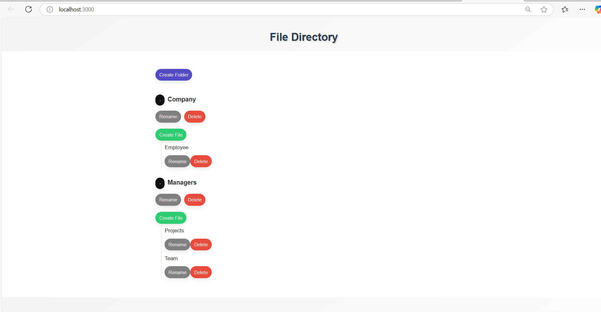

# File Directory UI -Frontend


## Overview

This project is a **File Directory UI** built with **React.js**, **HTML**, and **CSS**. It allows users to:

- **Create** folders and files.
- **Rename** folders and files.
- **Delete** folders and files.
- **Expand/Collapse** folder contents.
- Reflect changes dynamically without page refresh, utilizing React's state management.

## Features

- **Create Folder**: Users can create new folders in the file directory.
- **Create File**: Users can create new files within folders.
- **Rename Folder/File**: Users can rename folders and files directly.
- **Delete Folder/File**: Users can delete folders and files with a confirmation prompt.
- **Expand/Collapse Folders**: Users can expand or collapse folders to show or hide their contents.
- **Dynamic Updates**: Changes are reflected instantly without page refresh using React's state management and event handlers.

## Screenshots

## Tech Stack

- **Frontend**: React.js, HTML, CSS
- **State Management**: React State Hooks (`useState`, `useEffect`)

## Requirements

Before running the project, ensure you have the following installed:

- **VS code**: [Download Node.js](https://nodejs.org/) node 18.x.x version 

- **Node.js**: [Download Node.js](https://nodejs.org/) node 18.x.x version 
- **npm**: npm is included with Node.js, but you can also install it separately via [npm](https://www.npmjs.com/).

## Installation

1. Clone the repository:
   ```bash
   git clone https://github.com/shelaranuradha2024/file-directory.git
   cd file-directory-frontend

In the project directory, you can run:
### `npm install`

### `npm start`

Runs the app in the development mode.\
Open [http://localhost:3000](http://localhost:3000) to view it in your browser.

The page will reload when you make changes.\
You may also see any lint errors in the console.


